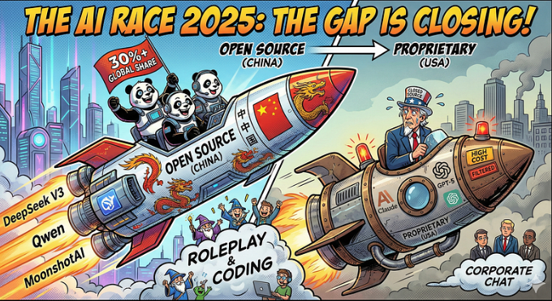
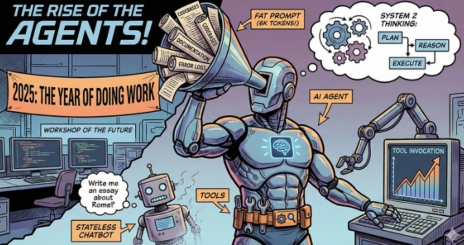
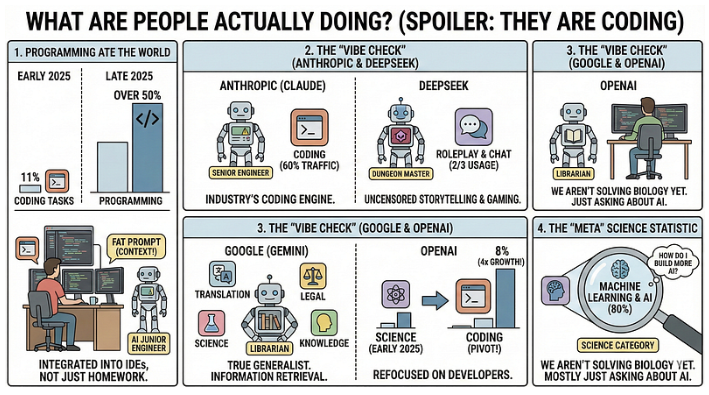
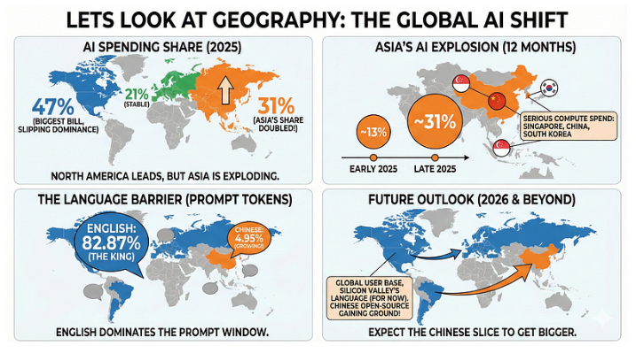
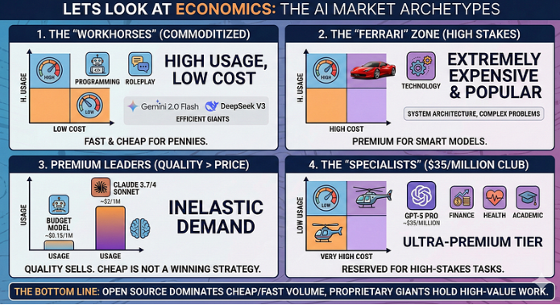

# State of AI in 2025

*Written on Dec 30, 2025*

In this article, lets look at 2025 trends concerning language models.

2025 was the beginning of "Agentic Era". I said something similar in 2024 and took a massive bet in my career against the traditional route and went all in on agents. It was all worth it.

If 2024 was the year where ai was the chatbot, 2025 has effectively become the year where ai is the thinker. Ever since OpenAI dropped the o1 model last December, the entire landscape shifted to systems that actually pause, reason, and plan before they speak.

But looking back at this whirlwind year, a massive question remains: beyond the flashy benchmarks and Twitter hype, how are we actually using these things? 
To answer that, I'm diving deep into a fascinating new study from [OpenRouter](https://openrouter.ai/state-of-ai), which analyzed over 100 trillion tokens of real-world traffic. From the explosive rise of chinese open-source powerhouses like DeepSeek and Qwen to the quiet dominance of "agentic" coding workflows, here is what the data really says about the state of AI in 2025.

> Note: This entire study is based on data from OpenRouter. While massive, it is just one window into the ecosystem. It doesn't capture everything.

### 2024 to 2025
It is almost jarring to look back at the AI landscape of early 2024. Just a year ago, "state-of-the-art" meant autoregressive models that were incredibly good at predicting the next word, but ultimately trapped in a single forward pass. We had impressive attempts to mimic reasoning and tool use but they were essentially simulating thought, not performing it. The paradigm didn't truly break until 5th December, 2024, with the release of OpenAI’s **o1** (codenamed Strawberry). That was the moment the industry pivoted from models that generate patterns to models that engage in **multi-step deliberation** and latent planning before they type a single character. We had a glimpse of "Agency".

## Open Source: The Gap is Closing (And Fast)

If you asked anyone in 2023 whether they would trust an open-source model with their production workload, the answer was usually a polite "no". In 2025, that answer is "yes".

According to the data, proprietary models (think Claude, GPT-5) still hold the maximum share of total traffic, which is about 70%. But the remaining 30% shows that open source models are closing the gap. Open-weight models aren't just for hobbyists anymore; their usage has surged, driven heavily by massive releases like **DeepSeek V3** and **Kimi K2**.

### The Rise of the "Middle Class" Model

One of the most interesting trends in the report is the death of the "small" model. Throughout 2024, we saw a flood of tiny (<7B parameter) models designed to run on consumer laptops. The data shows people stopped using them. Instead, the market has congregated around a new **"Medium" class (15B–70B parameters)**.

Think of models like **Qwen2.5 Coder 32B** or **Mistral Small 3**. They occupy a sweet spot: smart enough to do real work, but efficient enough to not bankrupt you on inference costs. It seems 30 billion parameters is the new 7 billion.

### The Chinese Model Explosion

We cannot talk about 2025 without mentioning the elephant in the room: Chinese open-source labs are absolutely crushing it.

- **DeepSeek** remains the king of volume, serving a massive 14 trillion tokens.
- **Qwen** (Alibaba) and **MoonshotAI** have become staples in the developer toolkit.
- In fact, in the second half of 2025, Chinese OSS models alone captured nearly 30% of global token traffic in some weeks.

This isn't just about copying Western models anymore. Labs like DeepSeek are iterating at a breakneck pace, often releasing better versions of their models (V3, R1) before competitors can even catch their breath.

### What Are We Actually Using Them For?

So, people are downloading these open weights, but what are they doing with them? The taxonomy breakdown is hilarious and revealing:

- **Roleplay (~52%):** Yes, the majority of open-source compute is still going toward creative, character-driven chat. This makes sense because open models are often less "filtered" than their corporate counterparts, making them the go-to for fiction, gaming, and "creative" dialogue.
- **Coding:** This is the second biggest bucket. Developers are increasingly trusting open models like **Qwen Coder** to write their software, likely to avoid leaking proprietary code to a closed API.

The takeaway? If you need a corporate chatbot that won't say anything controversial, you stick with Closed Source. If you want to write code cheaply and without leaking any company secrets, or roleplay as a wizard without a safety filter lecturing you, you go Open Source.

## The Rise of the Agents (And Why Prompts Are Getting "Fat")

If the first half of the 2020s was about getting AI to write poetry, 2025 is clearly about getting AI to _do work_. I have mentioned this a lot in my previous articles. 2025 is the year of AI Agents. The report calls this shift **"Agentic Inference"**, and the metrics are staggering. We aren't just chatting anymore; we are building automated loops where models plan, reason, and execute.

### 1. Reasoning Models Are Now the Majority

Here is a stat that should wake you up: In early 2025, "reasoning" models (like o1) were a niche curiosity. Today, **over 50% of all token traffic** flows through reasoning-optimized models.

The leaderboard here is surprising. While OpenAI kicked this door open, the current volume leaders for reasoning are xAI’s **Grok Code Fast 1** and Google’s **Gemini 2.5 Pro**. Developers are clearly voting with their wallets for models that can handle "System 2" thinking, i.e, multi-step logic and state management.
### 2. The "Fat Prompt" Phenomenon

The shape of our requests has fundamentally changed. The data shows that the average prompt length has **quadrupled** in the last year (from ~1.5k to ~6k tokens).

Why? Because we stopped asking open-ended questions like _"Write me an essay about Rome"_ and started dumping massive context into the window. The primary driver here is **Programming**. Developers are pasting entire codebases, documentation, and error logs into the prompt (routinely exceeding 20k tokens) and asking the model to debug or refactor. AI is no longer a creative writer; it is an **analytical engine** digesting huge amounts of data to produce concise, high-value fixes.
### 3. Tools or Die

Finally, the "Tool Use" graph is up and to the right. Models that can reliably call external APIs (tools) are winning; those that can't are being left behind.

We saw a massive spike in tool invocation starting mid-year, driven by models like **Claude 4.5 Sonnet** and **Grok Code Fast**. This confirms that the median LLM usage is shifting from a single-turn "Q&A" to a multi-step agentic loop where the model uses tools to fetch data, run code, and iterate.

**The Bottom Line:** The era of the "stateless chatbot" is fading. The new default is a reasoning agent that reads thousands of lines of context, plans its next move, and executes code.

## What Are People Actually Doing? (Spoiler: They Are Coding)

If you ignore the noise and look strictly at the token counts, humanity currently uses AI for two main things: **building software** and **make-believe**.

### 1. Programming Ate the World
The most explosive trend in the 2025 data is the absolute takeover of **Programming**. In early 2025, coding tasks were just 11% of the total volume. By the end of the year? **Over 50%.** This is not just random students asking for help with homework. The shift correlates perfectly with the "Fat Prompt" trend we saw earlier. Developers are using LLMs as integrated components of their IDEs, pasting in massive contexts, and treating models as junior engineers rather than search engines.
### 2. The "Vibe Check": Every Model Has a Personality
One of the funniest insights from the report is how distinct the user bases are for each major provider. The data paints a clear picture of "who is using what":
- **The Senior Engineer (Anthropic):** Claude is effectively the industry's coding engine. For most of the year, **over 60%** of all programming traffic went to Anthropic. If you are writing code, you are probably using Claude.

- **The Dungeon Master (DeepSeek):** DeepSeek has a totally different vibe. Its traffic is dominated by **Roleplay** and casual chat (nearly 2/3rds of its usage). It is the go-to model for storytelling, gaming, and "uncensored" creative writing.

- **The Librarian (Google):** Gemini is the true generalist. Its usage is the most diverse, spanning translation, legal, science, and general knowledge. It’s less of a coding specialist and more of an information retrieval machine.

- **The Pivot (OpenAI):** OpenAI is interesting here. Early in the year, it was heavy on "Science." But realizing Anthropic was eating their lunch in the developer space, they pivoted hard. Their share of coding traffic has quadrupled (from 2% to 8%) as they refocused on developer-centric workloads.
### 3. The "Meta" Science Statistic
A small but telling detail from the long-tail data: The "Science" category looks big on paper, but when you zoom in, **80% of it is just people asking about Machine Learning.**

We aren't using AI to solve biology or physics problems yet. Mostly, we are just using AI to ask questions about how to build more AI.

## Lets Look at Geography
For years, AI has felt like a party hosted exclusively by North America. In 2025, the rest of the world finally showed up. 

While North America still foots the biggest bill (accounting for **47%** of global spend), its dominance is slipping. The real story this year is the explosion of activity in **Asia**. In just twelve months, Asia’s share of global AI traffic **doubled**, rocketing from ~13% to nearly **31%**.

This is not casual browsing, it is serious compute spend driven by tech hubs in Singapore, China, and South Korea. Europe, meanwhile, has remained remarkably stable, holding a steady ~21% of the pie.

**The Language Barrier Hasn't Broken (Yet)** 
Despite the geographic shift, English remains the absolute king of the prompt window.

- **English:** 82.87% of all tokens.
- **Chinese:** 4.95% (a distant second, but growing).

We are seeing a global user base, but they are still largely speaking the language of Silicon Valley, for now. With Chinese open-source models gaining ground, expect that 5% slice to get much bigger in 2026.

## LLM's Customer Retention.

Retention in AI is usually a horror story. New models come out every week, and developers are notoriously fickle, jumping ship for whatever is 1% cheaper or 2% smarter. But the report found a fascinating exception to this rule, something they call the **"Cinderella Glass Slipper"** effect.
### The Theory: Workload-Model Fit

The idea is simple: You have a specific, hard problem (a "workload"). You try every model until one finally fits, like the glass slipper. Once you find that fit, you stop looking. You build your infrastructure around it, and you stay.

This creates **"Foundational Cohorts."** These are the early adopters who used a model right when it launched, realized it solved a previously unsolvable problem, and never left.

- **The Winners:** We see this clearly with **Claude 4 Sonnet** and **Gemini 2.5 Pro**. Their early user cohorts have massive retention rates (~40% after 5 months), while users who joined later churned much faster. The early birds found the fit; the latecomers were just browsing.
- **The "One-Hit Wonder":** Look at **GPT-4o Mini**. It had _one_ massive foundational cohort at launch that stuck around forever. Everyone who joined after that initial window? They left immediately. This shows that the window to be "special" is incredibly small.
### Deepseek is an Exception

Then there is **DeepSeek**, which breaks all the rules. DeepSeek’s retention curves show a weird pattern: users leave, and then _they come back_. The report calls this the **"Boomerang Effect"**. It implies that developers try to switch away from DeepSeek (maybe to a proprietary model?), realize the alternatives are either too expensive or not actually better, and begrudgingly return. It is the ultimate sign of a model that owns its niche on price-to-performance.

**The Takeaway:** If a model has high retention in its first month, it means it actually broke new technical ground. If it doesn't, it’s just another commodity.

## Lets look at Economics
When it comes to money, the AI market is starting to look a lot like the car market. You have your daily commuters (cheap, reliable), your luxury vehicles (expensive, high-performance), and a few clunkers nobody wants even if they are free. The report maps every category and model on a Cost vs. Usage log-plot, and four distinct archetypes emerge:

### 1. The "Workhorses": Coding and Roleplay
The top-left quadrant (High Usage, Low Cost) is dominated by the two biggest use cases: **Programming** and **Roleplay**. This confirms a massive trend: the highest-volume AI tasks are being commoditized. Users want these interactions to be fast and cheap. This is the home turf of **"Efficient Giants"** like **Gemini 2.0 Flash** and **DeepSeek V3**, models that are good enough to get the job done for pennies.
### 2. The "Ferrari" Zone: Technology
There is one massive outlier in the data: **Technology**. Unlike programming (which is about writing code), the "Technology" category refers to high-level system architecture and complex problem-solving. It is the _only_ category that is both **extremely expensive** and **extremely popular**. Users are willing to pay a premium here because the stakes are high. If you are designing a distributed system, you don't want the cheap model; you want the smart one.
### 3. The "Premium Leaders" Where Quality > Price
Perhaps the most encouraging finding for labs like Anthropic is that **quality still sells.** Models like **Claude 3.7/4 Sonnet** sit in the "Premium Leader" spot. They cost significantly more than the budget models (~$2/1M tokens vs ~$0.15/1M), yet their usage remains massive. This proves that demand for intelligence is relatively **inelastic**. 
If a model is genuinely smarter (more reliable reasoning, fewer hallucinations), developers will pay the premium. "Cheap" is not a winning strategy if the model is dumb.
### 4. The "Specialists": The $35/Million Club
Finally, we have the ultra-premium tier, occupied by models like **GPT-5 Pro**. These cost a staggering ~$35 per million tokens. Usage here is low, but that’s by design. You don't take a helicopter to the grocery store. These models are reserved for "Specialist" tasks like high stakes Finance, Health, or Academic queries where a single mistake costs more than the API bill.

**The Bottom Line:** The "Race to the Bottom" on price is only half the story. While Open Source dominates the cheap/fast volume, the proprietary giants are successfully holding onto the high-value, high-complexity work.

## Conclusion

If this massive dataset tells us one thing, it’s that the era of the "General Purpose Chatbot" is effectively over. We aren't looking for one model to rule them all anymore; we are looking for the right tool for the job.

The State of AI in 2025 is defined by **fragmentation and specialization**:

- **The Ecosystem is Split:** We trust proprietary giants (Claude, OpenAI) with our high-stakes, expensive system architecture, but we turn to the open-source providers (DeepSeek, Qwen) for our creative roleplay and high-volume tasks. This is a good sign for this space.

- **The World is Watching (and Building):** The US dominance is eroding. With Asia’s share of compute doubling to 31% and China producing top-tier open models, the next big breakthrough is just as likely to come from Beijing or Singapore as it is from San Francisco. This is also a good sign for this space.

- **From Chat to Agents:** The "fat prompts" and rising tool usage prove that we stopped treating AI like a conversational partner and started treating it like an employee. We are building **Agentic Workflows** that have loops of planning, reasoning, and executing, that are far more complex than simple Q&A. This is one trend which I am not sure where it will lead us. Apocalypse or a better society.

**The Final Lesson: Retention is Everything** Ultimately, the most haunting insight from this report is the "Cinderella Glass Slipper" effect. In a market flooding with new models every week, raw intelligence is becoming a commodity. The only defensible moat left is **Workload-Model Fit**. The winners of 2026 won't necessarily be the labs with the highest benchmarks; they will be the ones who solve a specific, painful problem so perfectly that their users never bother to try on another shoe.

2024 was about the hype. 2025 was about the reality check. And if the data is right, 2026 is going to be about who stays.