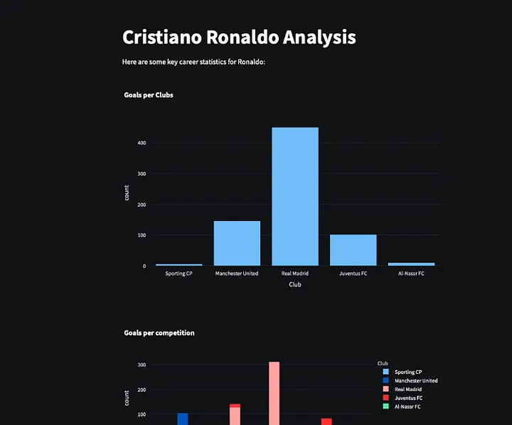

# My 4 year CS adventure

*Written from Sept 4 to Sept 12*

> TLDR: Went from gamedev to botdev to cybersec to webdev to dsa (and little bit CP) to compilers to ai ml. Side Quest: building an OS. Worked at 5 startups. All remote.

Its September 2025. 4 years ago, I started my computer science degree. I think now is a good time to look back into the journey so far and see how I got here.

*Projects was the only thing I did. I had more than 100 repos with so many projects (unfinished and dead)*

I am not a high IQ induvidual. Infact, my raw intelligence is not my shiny badge. Its my "passion". Now that seems like a big word, but honestly, everything I do is attached to how much I enjoy doing it.

I kind of sucked in school. I was good at math and stuff, but I soon realized I am not "special". I used to think, being "special" is the only way you can win in life. Glad my mindset has changed.

You win in life when you wake up and you are looking forward to the day. That's success according to me. 

Working at a high paying remote job was my goal back when I started college. I am glad I have that now, but there's something more important which I have: My Ikigai

Lets look into how I explored every shiny field, left whenever I felt like, juggled multiple interests and finally decided what I like.

## Game Dev
I used to watch Dani on youtube, and I liked the idea of building worlds using code. That was super interesting to me. So I started learning programming for that. I was doing java and python problems on hackerrank, watching youtube videos and learning heavily.

I took part in a club event, where me and my team were supposed to build an action rpg in godot. That was a failure but I learnt a lot. Godot and GDscript were primarily used.

Here are some of the games that I build over the next 2–3 years (no particular order). Built games in different languages: Godot, C, Javascript, Python.

*Action RPG game we built back in sem1*

*I tried building games in c, python (ursina and pygame)*

*A simple javascript based legend of zelda clone*

*Got back to godot after 3 years*

## Bots

I still wanted to make a fully fledged game but I took the advice of build build build seriously and started hacking on small scale dev projects. Building bots was fun, and I kind of learn a lot which you normally wont learn by simply watching python tutorials or reading books.

*A simple twitter bot that I built in sem 1*

## CyberSecurity and CTFs

Back in my 2nd semester of college, I wanted to explore cybersecurity and hacking. It seemed cool. I did a udemy course on Pentesting. I didn't understand much but that course helped me become better with shell, commands and linux. Infact I gave a talk on Linux for Ethical Hacking for our Cybersec Club (Got disbanded in the same semester :X )

*This was tuff back then*

I changed my room and my new roomies were into cybersec. We used to solve CTF problems and take part in CTFs as well. I just barely touched the surface. There were lot of concepts I thought of covering but never did.

*picoGym was super interesting*

Around this time (3rd semester), I started using nvim as my daily driver. It was super frustrating, and it took me 1 full semester to become decent at it.

*I wrote a custom config following some tutorial*

### Desk Upgrade Jan 2023!

## IoT
I took part in a IoT hackathon. It was a workshop cum hackathon. This is where I got introduced to the world of sensors. I built some cool projects.

*Arduino Uno and IR Sensors*

*A 3d world where you interact using your hand gestures*

## Classic: Web Development
I realised building websites is cooler than anything. And I wanted to do that. Although we had a course on webdev in 3rd semester, I never really understood more than html and css. I took a course on udemy and I didnt understand that as well. Summer holidays of 2023 was when I fully understand how a backend and a frontend works. I learnt it on my own using chatgpt + freecodecamp courses as well. I started building website projects.

*Freecodecamp courses were one of its kind*

During our summer course (4th sem), We had to build an AI App which does "something". I built a pokedex for real animals. This was my first fullstack AI project and it was fun.

*jungleGPT*

Around sept-oct 2023 (5th sem), I built leetarena. This was my first huge project which involved a lot of concepts. I tried to make it as neat as possible but it had shit ton of bugs.

*leetarena*

## DSA and Competitive Programming
Are you really an indian CS student if you haven't done CP and DSA. I spent 3–4 months on codechef, and then was solving leetcode passively. I was doing great with CP. I thought I will get 4 stars and things will be smooth.

Well that didn't happen. I kind of lost interest in participating in contests. I still like solving problems.

Reached 2 stars on Mar 2, 2023

*My Codechef profile*

At some point, I had to make a decision. Do DSA, or let my curiosity guide me.

I was quite nervous because I wanted a high paying job, and not doing so would hurt my ego.

*My Leetcode profile*

This is my leetcode. I didn't even reach 200 mark. And it wasn't really needed as well.

Well, things turned out fine in the end. Following what my mind wanted was the best choice I would say.

## Compilers, Interpreters

During my 5th sem, I was intrigued by the idea of writing a programming language of my own. I had one of my frnd who did it way before. I wanted to do it aswell. I was watching tutorials and writing code. I kind of understood the internals of an interpreter.

*Zenscript. You can declare variables and do basic arithmetic*

Later, in 6th sem we had a course on compilers which gave me even more clarity on how these things work.

Honestly, its like witchcraft. And I want to dive into it again when I catch some time.

By the end of 5th semester, I got an internship. The person who hired me liked projects like these. I was learning rust by building a [simple markdown compiler](https://github.com/theyashwanthsai/MDcompiler?tab=readme-ov-file).

I got fired from that internship in 2 weeks.

## Databases

I took an elective on database technologies in my 6th sem. It was fun, but I kind of realized I didn't like it much.

I spent few weeks building a small distributed KV store in Golang, following a [tutorial](https://notes.eatonphil.com/minimal-key-value-store-with-hashicorp-raft.html). It was a fun project.

*This was the setup. Honestly I forgot a lot about this project.*

## AI Agents
AI ML was a buzz word for every CS student. ML was everywhere. Even before the rise of chatgpt, everyone wanted to do datascience and machine learning. I tried ml at the end of sem 4. I tried making some cool projects using streamlit.

*Anime recommendation System*

After making few projects, I kind of didnt like ML. I was more interested in compilers and backend related stuff. So I left it.

*I did an Data analysis on Ronaldo's Career*

One year later (6th sem, march 2024), when everyone was building API wrappers and Coding tools, I wanted to try my shot as well. 
Think about it, AI apps are just a backend project. We just use an llm api. 

Hence I started building projects. I wrote a neovim plugin which would do code completions.

*Opilot.nvim*

I also worked on a research project with [Soham](sarkarsoham.com). It was my first publication.

*IEEE CONECCT 2024*

Around this time, I wanted a summer internship. I was shit scared, and kept on applying to a lot of places. I realized MNCs need dsa, and I dont know shit about dsa.
So my only option was startups. I cold messaged so many founders and had only 3 ppl replying back. Out of which 1 was **Composio**.

I had to do a take home assignment: AI Agent which uses composio. 

Eventually got in. I learnt a lot about AI Agents here. This was my first time hearing the word.

While at composio, I also tried building a silly idea. This later turned out to be life changing.

I built devyan. Basically AI Agent team roleplaying as an SE team. I learn about SDLC and a lot of things from a course Software Engineering in 5th sem.

*I built my own AI programmer team*

*Featured on AICodeKing*

I left Composio because I wanted focus on DSA and sit for college placements. 2 weeks after leaving, I got reached out my current employer. I joined Vuhosi as a founding engineer.

I had mixed thoughts about placements. 10 days in placements and I realized its not for me and stopped sitting for it. I already had vuhosi in my bag so I started chilling.

Around Sept 2024, I signed a contract with manning. I am writing a book on AI Agents. How cool is that

Dec 2024, I gave my [first Microsoft Reactor talk](https://www.youtube.com/live/Z8wIyqEUKyA) on AI Agents. I gave my [second talk](https://www.youtube.com/live/Uuor1o809NY) on Feb 2025 again on Agents.

### Desk Upgrade 2. Aug 2024
Built my own gaming pc with all the money saved from 2 internships (plus credit card). Childhood dream.
Read more about it [here](https://www.saiyashwanth.com/pcbuild)

*Gaming PC. GPU: RTX4060*

## Turilabs
I started turilabs in nov 2024. Initially it was started as an agency X research lab, and we infact had our first client. 

But we gave up, and I turned it into a pure research lab.

*[turilabs.in](turilabs.in). This was the website when we launched. Things have changed a lot since then. Check out our website.*

We work on research projects, and write papers. If you want to work on a research project in AI/DL/RL, hit us up.

## ML
Well AI is fun, But whats more fun is to build models on your own. 

At turilabs, I wanna build foundational models. I have been learning math, and building ml models from scratch in python. Unlike last time, this time I have a goal. 

To be so good in deep learning so that I can build a small scaled foundational model.

I have written a blogpost on that. [Check it out](https://medium.com/@theyashwanthsai/how-i-am-learning-deep-learning-again-0bedd11dea09)

*Alexnet implementation in pytorch.*

I am currently diving deep in these topics:
- Mech Interp
- RL Envs
- World Models
- SLMs

## Side Quest: OSdev
I actually started "Build your own OS" journey back in 4th sem. But I stopped it.
Few months back i wanted to do it again, and it was a success. There's still a long way to go, but I am sure this project will out nicely.

*Simple Hello World OS*

## Desk Upgrade 3. Sept 10
Finally gave in to the dual monitor wish. Let's see how good or bad this is.

*My current Desk*

## What's next
I am thinking about a phd in ml. Not sure but I want to do deep research. Maybe expanding turilabs is an alternative.

I also want to build small and cool games. 

I wanna learn pixel art.

I also wanna expand my OSdev project. 

I am currently spending most of my free time learning to build foundational models (deep learning).

A lot of things I want to do, but really very less time. Prioritizing is hard but thats what we can do.

## Conclusion
So yea, this was my last 4 years. Right before starting college, I was in a very bad state wrt my mental health. I used to feel like a loser. I wanted to raise above that.

Being optimistic is a "skill" I got after being at the lowest for a lot of time. But that was actually a good thing to happen. For some reason, I now have a crazy apetite for risk. I don't overthink or feel stressed when taking risks.

I think I developed a kind of love for the science behind computers and machines that live. I also really like research and want to contribute heavily to the society with whatever I can do.

Currently the goal is to develop machines which learn.