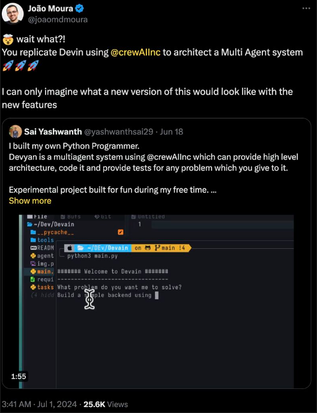

# What are AI Agents

> Note: This is more of a discussion than a tutorial. I hate writing tutorials. My blogs are written so that it sets you up with a roadmap to build the project. Building it is your own business. Get out tutorial hell!

*Written on Aug 20, 2024*

AI Agents have been a buzz around, and I have some experience building them (partly from my internship, and partly from my own interest around them). 

Recently I built this particular project trying to replicate devin (by using multiagent systems) and it blew up. Even the founder of crewai [reposted](https://x.com/joaomdmoura/status/1807537542411022468) it, all my friends liked it. 

So I have decided to write a mini tutorial/discussion on how I did it. It's been a long time since I wrote online. The last article was well received. I have decided to write more frequently about all the stuff I will build. 
  

### So what are AI agents?
Think of an agent as a human. No arms or legs. Has a brain (LLM) but no memory. He (agent) has three components, input, brain, output. You can give an input and expect an output.
The fun begins when you decide to give him arms and legs (tools). AI Agents are nothing without tools. Unless you don't give them tools, they are plain and simple chatbots (The main goal is to make them autonomous, completely on their own with little to no interaction)

Memory is another topic which needs an article of its own.

### Multi Agents?
Imagine a group of agents autonomously communicating with each other and trying to achieve a common goal. This is the foundation of Mutli Agent Systems (MAS).
Ok, now back to Devyan

I was playing around with crewai a lot (Love this framework, although there are many problems with it when pushing to production) and had a silly idea of simulating a software engineering team. I had learnt in a college course about the SDLC (Software Development Life Cycle) and thought of agents trying to implement a programming solution using SDLC. Right now the flow is as follows:

One interesting and future implementation I want to try is to implement TTD (Test Driven Development) based approach to build applications using Devyan.

So, We basically have 4 different agents. Each with their own roles and responsibilities.
### Tools
So agents are quite useless untill you provide them with tools. Tools are basically functions written and given to agents. Agents can execute this functions and perform actions. Some are very simple like creating a file and adding content, while there are tools which give access to building charts and graphs. 
The tools I have used here:
* File manager toolset: File Read, File Write, Directory Read, Directory Write
* Internet Tool
* Code Execution tool (In progress)
* Stackoverflow tool (In progress)

I learnt about tools thanks to my time at [Composio](https://composio.dev).

Heres a Demo

