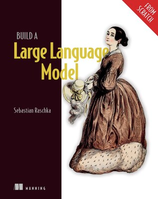

# Lets Build an LLM: Part 0

*Written on Aug 21, 2024*

So recently, I started reading [this](https://www.manning.com/books/build-a-large-language-model-from-scratch?utm_source=raschka&utm_medium=affiliate&utm_campaign=book_raschka_build_12_12_23&a_aid=raschka&a_bid=4c2437a0&chan=mm_website) book by [Sebastian Raschka](https://sebastianraschka.com)

This book is very well written, and very helpful to anyone who is interested or working in the field of AI/LLMS.

I decided that I will read this book and document whatever I learn on my site. I will be writing mini essays covering whatever I have studied. 
The goal is to make sure I follow [Feynman's Technique](https://aliabdaal.com/the-feynman-technique/) while learning AI. This [video](https://www.youtube.com/watch?v=gs_Sz4zzFks&pp=ygUNaGFyc2hpdCB0eWFnaQ%3D%3D) 
kind of inspired me as well.

Contents:
* [LLM Internals part 1](./llm1)
* [LLM Internals part 2](./llm2)
* [LLM Internals part 3](./llm3)
* [LLM Internals part 4](./llm4)

`Tags: LLM, Series`