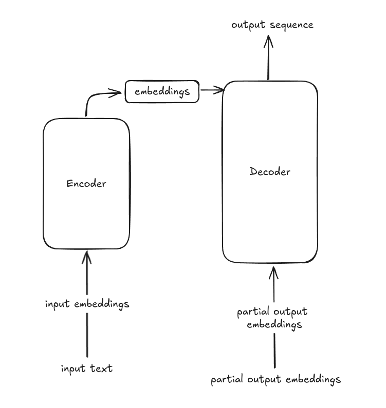

# LLM Internals part 1
> This article is part of [this](./llm0) series. My goal is to Learn AI using [Fenyman's Technique](https://aliabdaal.com/the-feynman-technique/)

*Written on Aug 21, 2024*

## What is an LLM?
LLM is basically a model which is trained to predict the next word in a sequence. 
It is a deep neural network model which follows the famous transformers architecture.
These models dont typically "understand" our language but can give coherently relevant results (next word). This makes them 
very useful for tasks involving generation or manipulation of texts.

## Why build an LLM?
Why build an LLM to understand its fundamental? Its been around 3-4 years since GPT has come out, and now there are a lot of other LLMs which are considered 
SOTA (State of the Art). But the underlying architecture is almost similar to the original GPT. 
Most of the newer LLMs are just minor tweaks here and there to the original architecture.
Hence learning this is crucial to understand the fundamentals. Might help if you are working with llms.

## Transformers Architecture
A quick overview of the transformer architecture from the paper [Attention Is All You Need](https://en.wikipedia.org/wiki/Attention_Is_All_You_Need)

The primary example shown in the paper was machine translation. The encoder converts the input embeddings into encoded embeddings which is input to decoder. Decoder uses both the 
encoded embeddings and partial embeddings to generate an output sequence.

__Self attention mechanism__ will be discussed later.

## GPT (and Bert)
GPT - Generative Pretrained Transformer is a deep neural network based autoregressive model. 
Each new word is chosen based on the preceding sequence. This is how the text is generated.
Originally it was developed to get the next word in sequence, but surprisingly, it was able to translate, find missing words, etc. This is known as emergent behaviour.

---

Rest will be continued in the next part. Go to [index](./llm0)

