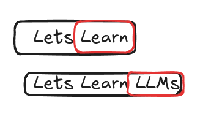

# LLM Internals part 2
> This article is part of [this](./llm0) series. My goal is to Learn AI using [Fenyman's Technique](https://aliabdaal.com/the-feynman-technique/)

*Written on Aug 22, 2024*

## GPT VS BERT
Both these models are based on the Transformers architecture. But there are some changes. GPT is based on the decoder of the original tranformers architecutre, while BERT
is based on the encoder. BERT can sort of find the missing (masked) word in an input text, while GPT gives the next word. Their application varies but the underlying architecture
is same and hence, its important to study the architecture in detail (and also code it!).

## Roadmap to build an LLM
General overview/structure. The whole series will follow this structure throughout.

- Data preprocessing
- Code attention mechanism
- Pretraining
- Finetune this base model

## Pretraining and finetuning
The basic idea is to train your llm on a large raw dataset. This will help the model understand the language.
The next step is to finetune on some specific data. This will make the llm perform better on some usecases. The pretrained model is considered base llm model.

__Self attention mechanism__: Although this will be discussed in more detail in the future, the basic idea is to assing some weights to certain parts of the input, This improves the quality a lot.

---

Rest will be continued in the next part. Go to [index](./llm0)

