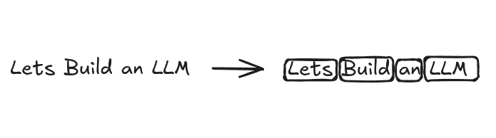
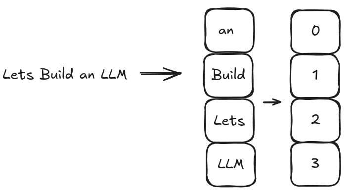

# LLM Internals part 3
> This article is part of [this](./llm0) series. My goal is to Learn AI using [Fenyman's Technique](https://aliabdaal.com/the-feynman-technique/)

*Written on Aug 24, 2024*

## Embeddings
The first step to build an llm is to prepare textual data for input. This is for pretraining. The main goal is to encode the text into numbers, so that the neural networks can work with this data.
Embeddings are basically vectors/tensors. The input text is split into tokens, this token is converted into some sort of ID, and these IDs are then transformed into embeddings. 

`Text -> Tokens -> IDs (Intermediary) -> Embedding vectors`

Note that there are multiple ways to embed your input. There exists different embeddings for different data types.

LLMs use word embeddings. We embed each word. 
Rag (Retrieval Augemented Generation) on the other hand uses sentence or paragraph embeddings.
Converting input text to vectors is important, and to do this, there are multiple methods/frameworks/algorithms. One such method is Word2Vec

### Word2Vec:
The basic idea is to predict the context of a word in a ssentence, provided you have the target word, or vice-versa. The principle here is that similar words cluster together.

When it comes to LLMs, They use an input layer (first layer of neural network) to produce their own embeddings. This is especially useful as it optmises our model for specific usecases.

Usually models like gpt 2 or 3.5 use higher dimensionality (embedding size). Its a tradeoff between performance and effeciency. 

## Tokens
We convert input text into tokens. This the first step, Then we convert this into IDs which we will cover in a moment.

## Vocabulary

So once we have converted the text into tokens, and these tokens to IDs, Its time to build the vocabulary. Vocabulary is basically all the unique words from the input, these words are sorted and are mapped to a number. 
`Text -> Numbers`

Note that LLM gives output which is basically numbers. Our task would be to apply inverse vocabulary function to convert these numbers to text. `Numbers -> Text`

> I am only discussing here, Theres no code or anything, although you can find in my github. The main purpose of these mini essays is that whatever I am learning, I want to teach it in form of micro lessons.

---

Rest will be continued in the next part. Go to [index](./llm0)

