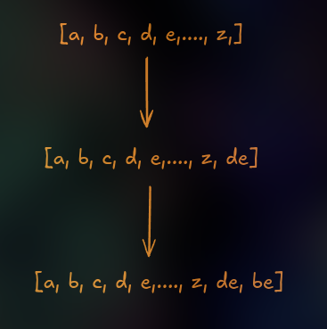

# LLM Internals part 4
> This article is part of [this](./llm0) series. My goal is to Learn AI using [Fenyman's Technique](https://aliabdaal.com/the-feynman-technique/)

*Written on Sept 14, 2024*

## Byte Pair Encoding
In BPE, We basically break unknown words (The words which are present in the input text, but not in the textual data which was used to create vocabulary).
Unknown words are broken down into subwords/characters. 
Lets look into how this works:

**Iteratively** merge frequent characters into subwords and frequent subwords into words. Lets take an example of the words `a, b, c, d`.

