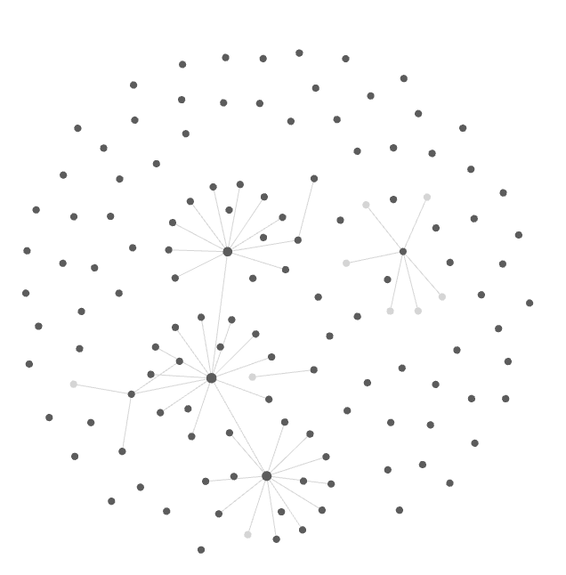

# M Shape

*Written on Jan 7, 2026*

We are never meant to master one thing. We were meant to be explorers. In this age of AI, mastering one thing might not be of much help, as it was 20 years ago. Being a jack of many and master of few is the ultimate goal.

Lets first define mastery. X number of hours in a particular skill/space/field. 

> Often X > 1000 hours.

You dont really need to go down deep leaving everything. Getting enough fluency in that space should suffice (atleast for now). When that has happened, you can then start another skill.

The idea is not an endless grind of starting and spending x hours. Rather, the aim should be to collect ideas from all these fields which you started, even they seem naive and beginner level. If you dont like something, you can leave and hop on to something else (My whole college was me dancing between different niche). 

When I say "collect", I mean a system to physically collect your ideas. A notepad, or a digital notetaking system. I have been doing it on obsidian for more than a year, and this is how my Idea Database looks like. Zettlekasten/Second Brain. I am reading up more on the Zettlekasten system.

This system will eventually compound over the years and you will be able to connect ideas from different fields. This ability is something which makes an individual insanely valuable.

# Final thoughts:
- Build one leg in one field/skill for a month or two. Go all in
- Build a system that can capture ideas, connect them, and recall when you are working on something new
- Repeat with whatever you find interesting. RL, Cuda, OSDev, GameDev, etc are some examples for me.
- Manage your passion ideas with your day job.
