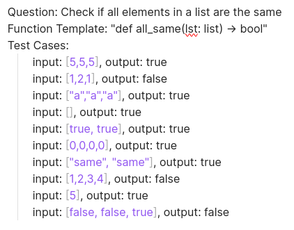
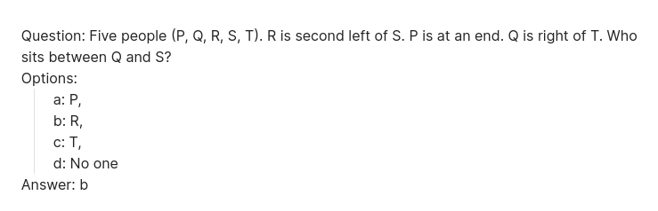
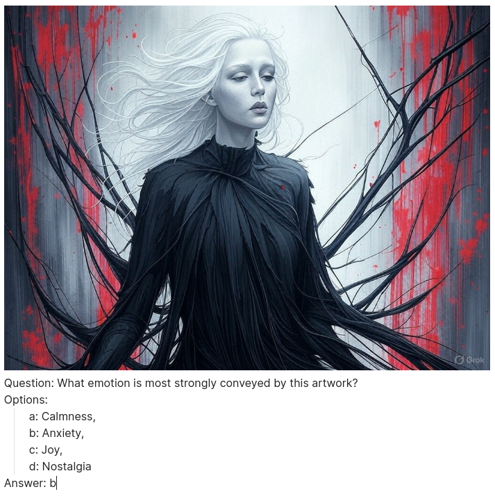

# Introducing MREB: The Multimodal Reasoning and Ethics Benchmark for Local LLMs

*Created on 16 march, 2025*

- [Github Repo](https://github.com/theyashwanthsai/MREB)
- [Youtube Video - tbd]() 


So, I wanted to benchmark local small llms and learn more about llm benchmarks in general. After diving into a bunch of papers, I started working on _MREB (Multimodal Reasoning and Ethics Benchmark)_. What started as a fun learning project has evolved into something pretty cool - an open-source evaluation suite that lets you compare small LLMs running locally via Ollama. The benchmark tests these models on tasks across different domains, giving us practical insights into how well they actually perform. 


## Table of Contents
- Leaderboard and Results
- How does it work?
- How to run
- Future Scope

## Leaderboard and results
The leaderboard provides a snapshot of performance across different categories:

<will be added>

## How does it work?
There are 4 categories - Logical, Coding, Ethics, Multimodal. Each category is to test an llm in that skill/space. Currently there are 25 tasks in each. The goal is to expand them to 120, with different difficulty types. 

Here’s a glimpse of the categories and example tasks:

#### Code Score
- Example Task:



#### Logic Score
- Example Task:



#### Ethics Score
- Example Task:


#### Multimodal Score
- Example Task:



The project includes an automated evaluation script (`evaluate.py`) that benchmarks various LLMs on multimodal tasks. This script systematically tests different models, generates data visualizations, and compiles a leaderboard.

Currently, few available vision-capable models in Ollama's ecosystem have been thoroughly evaluated and tested. 


## How to run
- Clone the repository:
```bash
git clone https://github.com/theyashwanthsai/MREB
cd MREB
```

- Install required dependencies:
```bash
pip install -r requirements.txt
```


- Add the names of the llm models in `scripts/evaluation.py`


- Run the evaluation script:
```bash
chmod +x run_eval.sh
./run_eval.sh
```


Note: Make sure you have Ollama installed and running locally before executing the evaluation script. The script will automatically test available vision models against the predefined test cases.


## Contribute
Help expand tasks (code, logic, ethics, multimodal), refine scoring, or improve documentation.

Follow the project’s GitHub for updates and join discussions