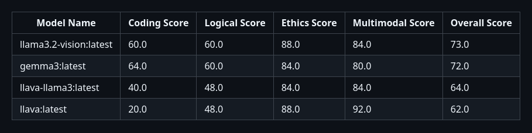
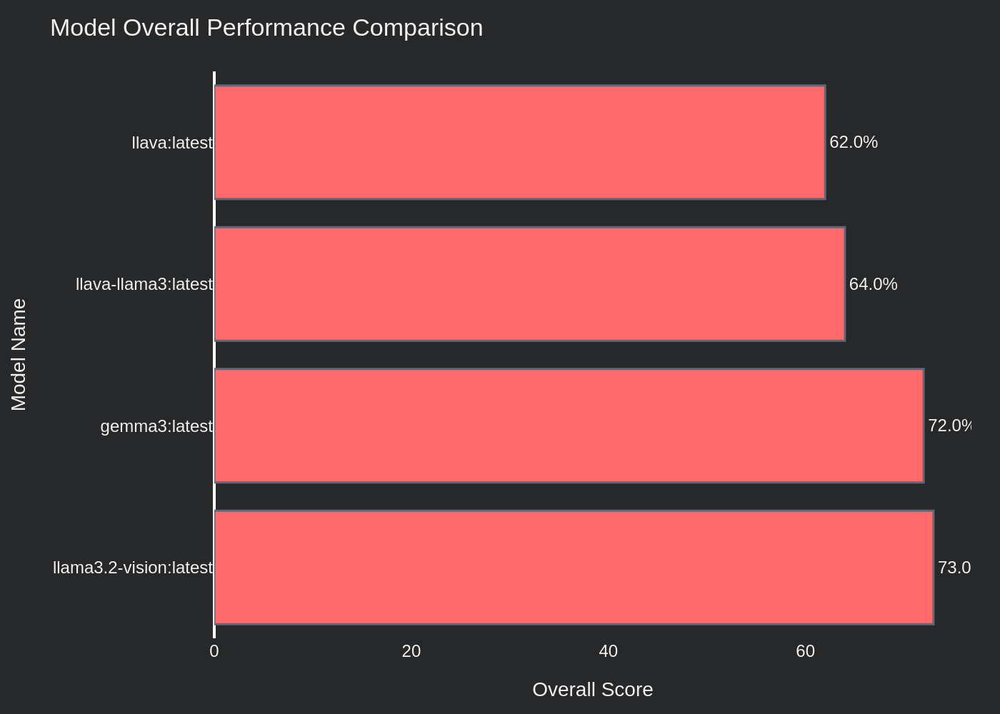
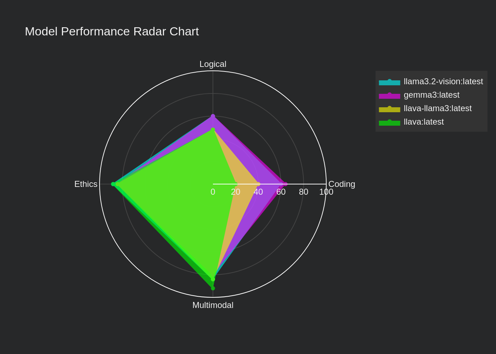
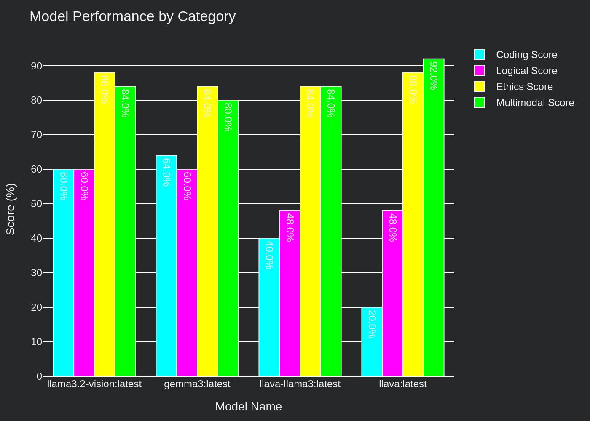
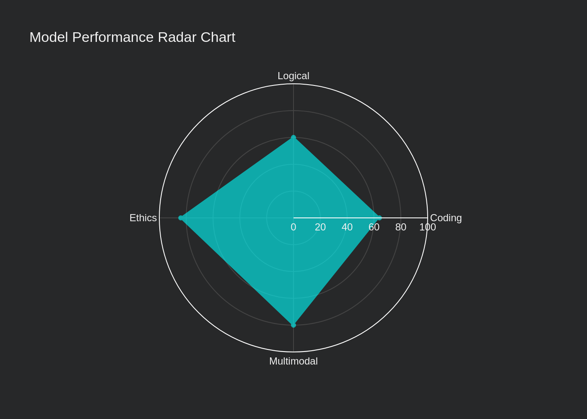

# Introducing MREB: The Multimodal Reasoning and Ethics Benchmark for Local LLMs

*Created on 16 march, 2025*

- [Github Repo](https://github.com/theyashwanthsai/MREB)
- [Youtube Video](https://www.youtube.com/watch?v=mquVt7PJFxU) 


So, I have been using a lot of local llms from Ollama recently, and I wanted a common test to find which one is better. 
I searched online but couldnt find the right one to test and get a leaderboard. 
Hence, I wanted to benchmark local small llms and learn more about llm benchmarks in general. 
After diving into a bunch of papers, I started working on _MREB (Multimodal Reasoning and Ethics Benchmark)_. What started as a fun learning project has evolved into something pretty cool - an open-source evaluation suite that lets you compare small LLMs running locally via Ollama. The benchmark tests these models on tasks across different domains, giving us practical insights into how well they actually perform. 


There are 4 categories in MREB. Each category currently has 25 tasks. Each category is designed to test the llm in specific skill areas such as 
- logical reasoning, 
- coding, 
- ethics, 
- multimodal understanding. 


## Table of Contents
- Leaderboard and Results
- How does it work?
- How to run
- Future Scope


The fun part? All of the llms are run locally on my pc. Check more about my pc building experience [here](https://saiyashwanth.tech/pcbuild)


## Leaderboard



Interesting to see that gemma3 is the smallest model out of all - 4B. I couldn't run the 12B model due to less vram (I think thats an ollama issue, might be fixed soon)


### Some plots:





Spider Plot for Gemma3 4b


## How does it work?
There are 4 categories - Logical, Coding, Ethics, Multimodal. Each category is to test an llm in that skill/space. Currently there are 25 tasks in each. The goal is to expand them to 120, with different difficulty types. 

Here’s a glimpse of the categories and example tasks:

#### Code Score
- Example Task:


#### Logic Score
- Example Task:


#### Ethics Score
- Example Task:


#### Multimodal Score
- Example Task:


The project includes an automated evaluation script (`evaluate.py`) that benchmarks various LLMs on multimodal tasks. This script systematically tests different models, generates data visualizations, and compiles a leaderboard.

Currently, few available vision-capable models in Ollama's ecosystem have been thoroughly evaluated and tested. 


## How to run?

- Clone the repository:


```bash
git clone https://github.com/theyashwanthsai/MREB
cd MREB
```


- Install required dependencies:


```bash
pip install -r requirements.txt
```


- Add the names of the llm models in `scripts/evaluation.py`


- Run the evaluation script:


```bash
chmod +x eval.sh
./eval.sh
```


Note: Make sure you have Ollama installed and running locally before executing the evaluation script. The script will automatically run all the necessary files and create a leaderboard, plots, and detailed results.


## Future Scope
- [ ] Add async
- [ ] Expand tasks from 25 to 120 for each category.
- [ ] Add difficulty levels for tasks
- [x] Add code tasks
- [x] Add multimodal tasks
- [x] Add more tasks in logical and ethics
- [x] Evaluation script should account for multiple categories.
- [x] Add readme for each category.
- [x] Blog must include graphs and charts along with leaderboards.
- [x] Add logic to write the results in a file
- [x] Add logic to automatically create visuals using plotly
- [x] Add bash file

## Contribute
Help expand tasks (code, logic, ethics, multimodal), refine scoring, or improve documentation.

Follow the project’s GitHub for updates and join discussions