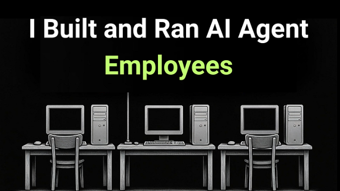
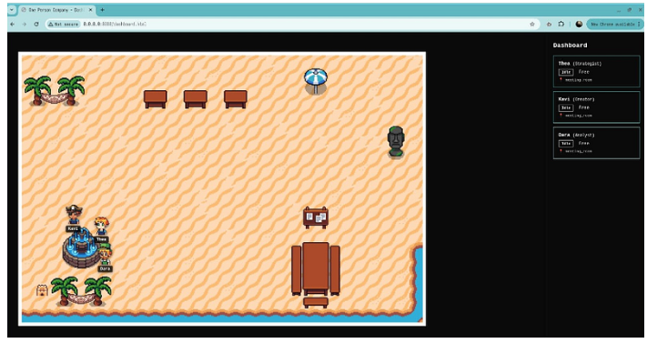
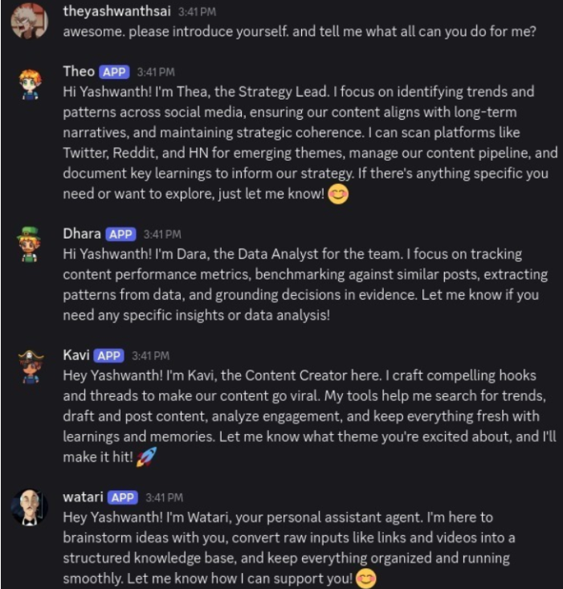
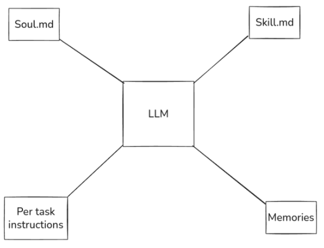
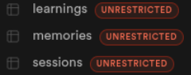
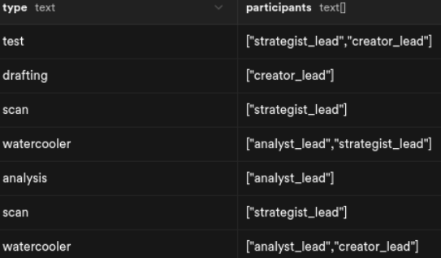

# Beyond OpenClaw Hype: My 24/7 Self-Hosted Team of AI Agents (Raspberry Pi)

*Written on Mar 01, 2026*

Since the last few weeks, there is a lot of buzz around the whole Openclaw situation. Mostly noise, and a bit of signal. Openclaw is one such technology which shows how disruptive AI actually can be. The whole internet is filled with noise and very little signal.

This post will be 2 things. One, My thoughts on the "agentic space" after this. Second, a showcase and technical deep dive on an agentic system that I built from scratch, that runs all day, similar to the openclaw setups that you might have seen online. This post will filter our the noise and hopefully help you see the real alpha behind this tech.

I have seen a lot of posts like "Limited window to escape underclass", "1 Person billion dollar startups", etc.  While there is some juice in this, I would say that most of these are simply doomposts to get twitter payouts. Fear mongering is one of the worst things happening to the AI Agent space and its sad.

YC released their request for startups 2026 (Very different from their 2025 one). What stood out for me was the call for AI native agencies. Initially it didnt make sense to me as to why YC would push the "agency" model. But after wrapping my head around it and talking to few folks, It sort of makes sense to me now.
## 1. AI Native Orgs
Clawdbot (changed to moltbot, and then later to Openclaw) has insane potential to make real world impact.

Agencies are all about scale. If one feature is lets say $5k, for an agency to make 50-100k, they simply need more people on the team. Ofcourse the client and scope also matter, but hiring is the only way to scale. TCS and Infosys (These are India's biggest software service agencies) scaled it so much back in 2000s, they are giants in the game.

Thing are changing now though, with these agents that work 24/7 and charge 10% of what a normal engineer charges. If done right, we can see a lot of agencies essentially turning into software companies. What I mean is, instead of hiring and managing people, they would build and manage agents. This is what I believe the real usecase of AI Agents could be. One usecase amongst many that is.

That being said, we are still early in this game, and you never know what will happen with AI. Quoting from this popular [article](https://shumer.dev/something-big-is-happening),

>"The future is being shaped by a remarkably small number of people: a few hundred researchers at a handful of companies... OpenAI, Anthropic, Google DeepMind, and a few others. A single training run, managed by a small team over a few months, can produce an AI system that shifts the entire trajectory of the technology."

Although we can‘t really predict what will happen, its always best to be an early adopter, try out new things and think from scratch on how this could change something that you do. This has a lot of benefits. You essentially develop this skill of adapting. Makes you deadly.

As for me, Clawdbot/Openclaw showed me what is possible with agents. Agent employees. Although this answer was quite apparent, but I was honestly hesitant to build it. But after the hype behind Openclaw, I simply built it.

I am building this with Opus 4.6 since the last few weeks. I went so much that I exhausted my cursor monthly limit in 2 days. But it was fun.

Let me break down what I built, how I built and why I built it.

## 2. One Person Company
I call this project the One Person Company. There are 4 AI Agents, that have their own job roles, personalities and goals. These 3 AI Agents work towards a common goal: Research. I want to write consistently and for that I should learn consistently.

I have always said how hard it was to keep up with the space. I see a lot of posts online, but I sadly dont have time to keep up.

Now I dont want AI to simply just dump information. I want these agents to act as a social media agency, drafting content ideas constantly. Me as the "Ceo" of this company will interact with the content generation pipeline to keep the my voice and ideas according to my style, but everything else (research, trends, analysis) will be done by these agents.

Currently there are 4 agents, a discord server where we interact, and a 9-5 schedule. The system runs on a scheduler on a raspberry pi that I selfhosted. The goal is to make these agents run 24/7, and interact with me like real human employees.

The project is currently open sourced, and I will be working on it regularly to scale the team to 10+.
### How I built it?
Here comes the fun part. Lets talk about the technical implementation. The code is open sourced so you can play with it. There are 3 part to understand here.

- The Agent abstraction that was built from scratch
- Memory Management
- Multi Agent Collaboration

#### Agent Abstraction
What I built:
Take an llm (api call, stateless), inject prompts (soul.md, heartbeat.md, instructions and intended skills, etc), add memory (covered in detail in next section), give tools.

This is how an agent works. I built this abstraction which converts an llm into an ”agent”.

#### Memory
This is something which is still an open question. So I basically created 3 SQL tables. Experiences, Learnings and Sessions (covered in detail in the next section).

An agent when executed, 2 things happen.
- The last few rows will be given to the agent.
- Agent should always write something in these 3 tables.

This makes my agent stateful. The tables evolve over time. Llm remains stateless. Combined, this becomes ”agentic”.

The problem is that this approach is cool. Your agent has rich experiences which is documented, and as time passes, this sort of evolves into something cool.

But the problem is, this is naive. After running for few weeks, the tables will get bloated. Passing all the rows to the agent will make the quality of output worse. Dont forget the cost.

There are few ways to solve this.
- Only pass the last ’x’ rows.
- Do some sort of contexual retrieval, and pass only those rows + last few rows.
- Diminishing memory. Just like humans, I want to only store the necessary information. Compressing the memory basically.

I have to experiment with these methods. I want my agents to have a job role, a soul and experiences. I also want to include ontology based memory in the future.

#### Agent Coordination
This is the important part. We have an llm with a lot of context (prompts, memory etc). But the true power of these agents only comes out when different agents coordinate with each other.

I have a concept called sessions. A session is basically an agent running. Think of my system like this. We have few humans with personalities and job roles. They are always sleeping. I wake them up at a particular time, give them instructions and make them do something. This is called a session. A session is the most basic unit of the system.

A session can be:
- A single agent doing a task.
- Two agents chitchatting (what I call a watercooler meeting)
- All of them brainstorming or attending a meeting
- A standup with me
- Urgent 1 on 1s

Sessions are what makes the coordination beautiful. I can let me agents communicate with each other, or with me and the summary/observation of that is stored in a sql table. This is what makes my team powerful. Each session improves the system as a whole. ”Evolves”

All of this combined, makes my agent team powerful. Ofcourse there is a lot of things to improve, and I am currently testing this. But day by day, the system is becoming insanely helpful.

I will be writing a lot on my experiences, headaches, and possible improvements in the future.
Thanks for reading. 