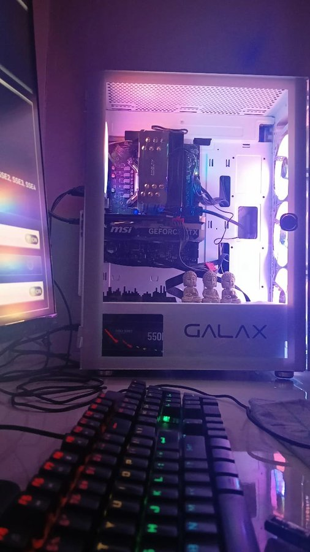

# Building my first PC

*Written on Aug 19, 2024*

So I decided to build a mid range gaming pc with the money that I earned/saved. 
My goal was simple:
A pc to play all the cool games I can as well as code/build cool stuff which I usually do.
Reddit, youtube has helped me a lot in this process. I spent a lot of time trying to understand and decide which parts would be good.
After a thorough research, I took my dads credit card, and started ordering all the stuff one by one.

## Specs:
* CPU: i5 12400f
* GPU: rtx4060
* Mobo: b760m
* Ram: 32gb ram stick (My motherboard has only 2 slots)
* SSD: 2TB NVMe M.2
---
I have learnt a lot while building this. I also realized how silly I am. I remember plugging in hdmi to my motherboard and worrying about my build not working. Had to refer to a lot of blogs, ask on reddit, rely on videos but i was able to do it in around 4-5 hours. 

I currently use pop os and windows 11 (Dual booted). I play on my windows and code on pop os. 

[RICE](https://x.com/yashwanthsai29/status/1821916975825608991)

Currently playing: Ghost of Tsushima. Love this game and the world.

This was an amazing experience and I love my pc.

`Tags: PC, Gaming, Fun`