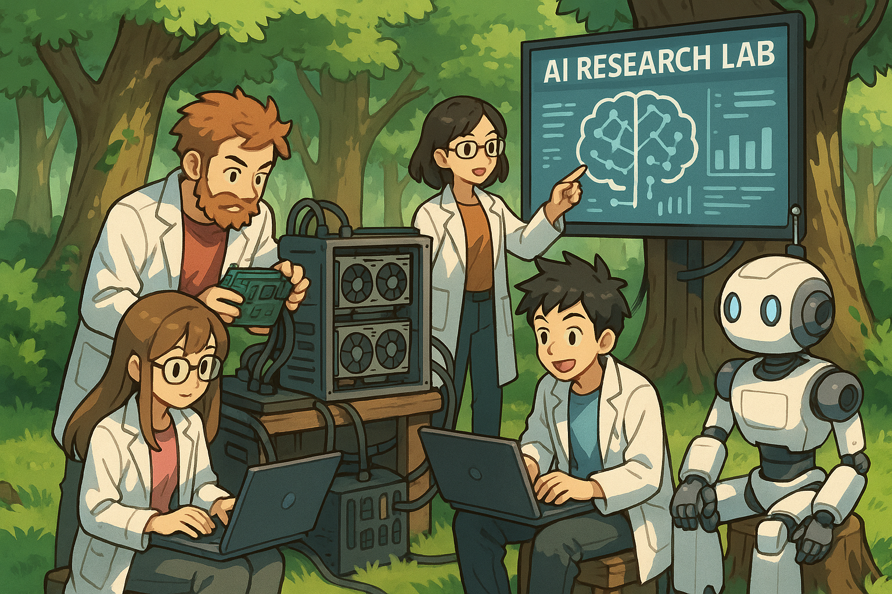

## Why Start a Research Lab? 1 year of Building my Indie AI Lab

*Written on 6th November 2025*

One year, 5 research papers, ~10 part time researchers, neurips workshop, and lots of learning.

Its been one year since I started turilabs, and our initial goals are much different than what we currently have. 2025 was the year of random exploration. 2026 will have some greedy exploitation. Our primary target will be RL Envs and Algorithms.

> Note: As we move into the next phase of Turilabs, we are opening up a small round **($40–50k)** to support compute, research and ops.
This will go toward GPUs, stipends for our part-time researchers, and open-sourcing more of our work.
If you're interested in supporting independent AI research as a backer, sponsor, or early investor, feel free to reach out.
[Pitch](https://turilabs.in/pitch). Mail: sai@turilabs.in. [Book or a call](https://cal.com/sai-yashwanth/15min)

Currently we have a team of part time researchers working on their passion projects under turilabs. From a 65 year old software veteran trying to make it into RL, to college juniors from across the world.

My philosophy is that, to do good research, we need to have good **intuition** and **taste**. The first year of turilabs was dedicated to us (me and my friends) reading a lot of good research papers. We picked random but interesting ideas (the thought of working on them gave us butterflies) and started building them. There was no pressure, no deadline. We just let our curiosity guide us. 

As a part of reflection, I started compiling my thoughts on how this lab shaped itself the way it is today. I really love these two words when I talk about turilabs: Indie and Lean. This gives us flexibility to **pivot**. Pivoting is seen as a bad thing, but its extremely necessary.

Let me list out the reasons why I might have consciously or unconsciously took decisions which shaped the birth of an indie lab, compared to the AI SaaS route.

## Reason 1
Well for starters, I am just afraid of taking risk and placing bets on the "SaaS dream". I would rather take it slow and at my own pace with a research lab. I pay for the credits and computation.

This way, I don't have to be driven by external factors like revenue targets or user acquisition. Of course, to most of you, this might look like I'm setting myself up for a downfall. I might seem coward. But I want to play the long game. That brings me to the next point.

## Reason 2
Look at the AI SaaS landscape today. Most of the products we see will eventually pivot to something else or simply fade away. Very few will actually become profitable and have a long, successful run.

Currently, I don't have the mental energy or that single outlier idea to chase this path.

## Reason 3
AI Research is too general. You could almost call it an "infinite pivot glitch". The thing is, when u pivot too much there is a negative perception from the audience. This might seem silly, but is important because audience (users) validate businesses. People are everything and there should not be a bad look to your brand.

This is why smart people often start an agency or an org that allows multiple iterations and experiments. Free from the burden of a single product identity.

## Reason 4
Foundational AI research is yet to catch up in India. It's a bold move to be an indie lab here, but that also makes us unique. Now, I dont mean being unique is a "cool" thing. But my point is, I feel in some ways, its doesnt feel wrong to be an indie research lab. Ofcourse, there is a mountain to climb both in terms of knowledge and operations, but I think we can do.

If our journey can inspire other people in the future, that would be an incredible outcome.

## Reason 5
Foundational research is fun. I can leave my job if I can make enough frm my medium + freelance gigs to keep me well-fed and happy.

I love working on projects with the simple intent to "try" something new. Experiments are fun to do. There are no hard deadlines, no manager on top of your head pushing you. You do the work based on your own rhythm and curiosity. For someone like me, that autonomy is essential. I do believe with enough time and right consistency, We can produce magic out of thin air.

## Final thoughts
My friends and I believe that we can produce something novel and impactful. It might be something small, but will definitely inspire bigger changes in the field. Something that can make people pause. Magic out of thin air. Something beautiful and undiscovered, just waiting for us to find it.

For now, we will work on ideas we like. Heads down. Because we know, it will take time. A good amount of time to actually shape the future with our ideas.